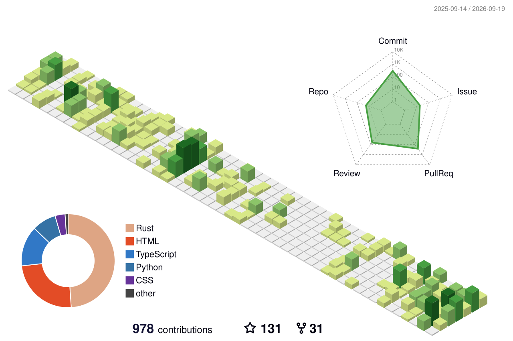

### Hi there 👋

- 🚀 Author of [Foyer](https://github.com/foyer-rs/foyer).
- 🛠️ Contributor of [RisingWave](https://github.com/risingwavelabs/risingwave).
- 🔭 Reviewer of [TiKV](https://github.com/tikv/tikv) [organization](https://github.com/tikv).
- 🔨 Build some interesting but useful smol tools [Verso](https://github.com/mrcroxx/verso), [Digger](https://github.com/mrcroxx/digger), [Olanzi](https://github.com/mrcroxx/olanzi), and more.
- 🌱 Interested in data infra system design and optimization.
- 📫 Email: [mrcroxx.cs@gmail.com](mailto:mrcroxx.cs@gmail.com).
- 🪺 Twitter: [@CroxxMr](https://twitter.com/CroxxMr).
- 🎞️ Douban: [叉鸽](https://www.douban.com/people/mrcroxx).
- ✨ Blog: [MrCroxx's Blog](https://blog.mrcroxx.com).
- 📁 Blog (Legacy, Chinese): [叉鸽 MrCroxx 的博客](https://blogx.mrcroxx.com)(Chinese).

### About me :octocat:

I'm a ~Rustcean~.

I am a ~Rustocean~.

I write Rust.

### Metrics 📈

<!--
**MrCroxx/MrCroxx** is a ✨ _special_ ✨ repository because its `README.md` (this file) appears on your GitHub profile.

Here are some ideas to get you started:

- 🔭 I’m currently working on ...
- 🌱 I’m currently learning ...
- 👯 I’m looking to collaborate on ...
- 🤔 I’m looking for help with ...
- 💬 Ask me about ...
- 📫 How to reach me: ...
- 😄 Pronouns: ...
- ⚡ Fun fact: ...
-->
